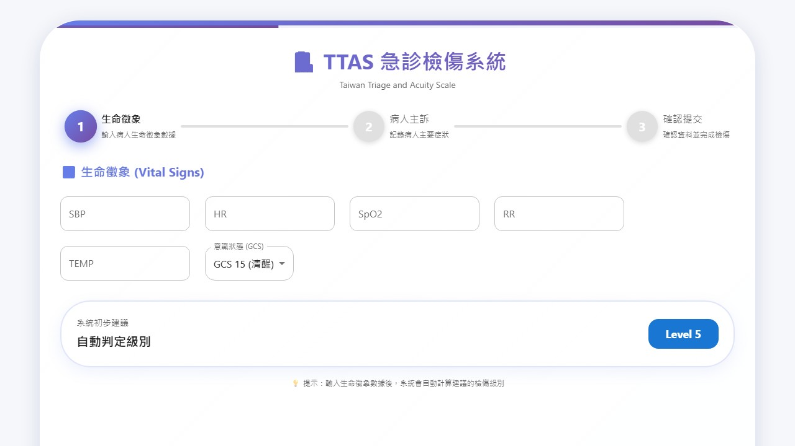
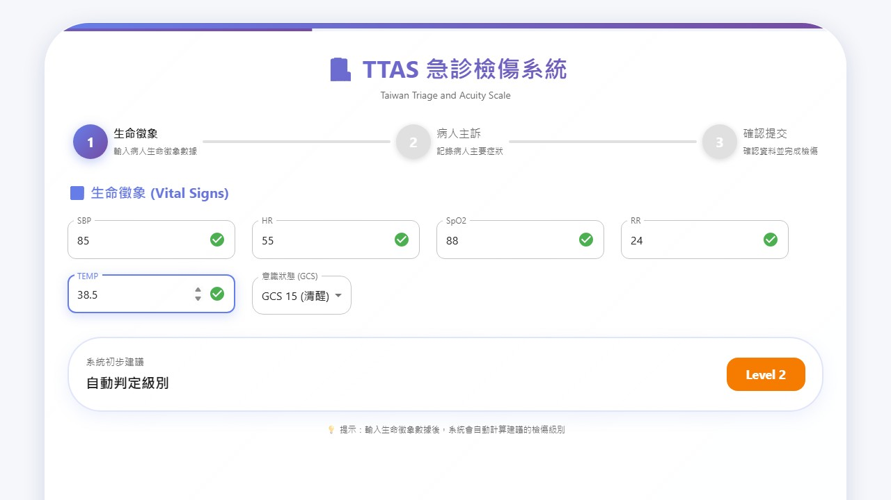
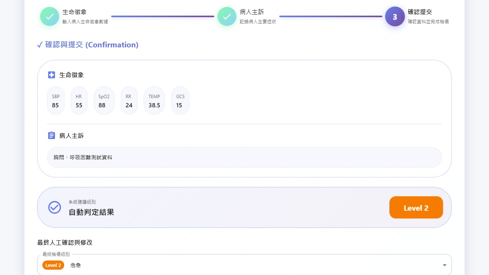
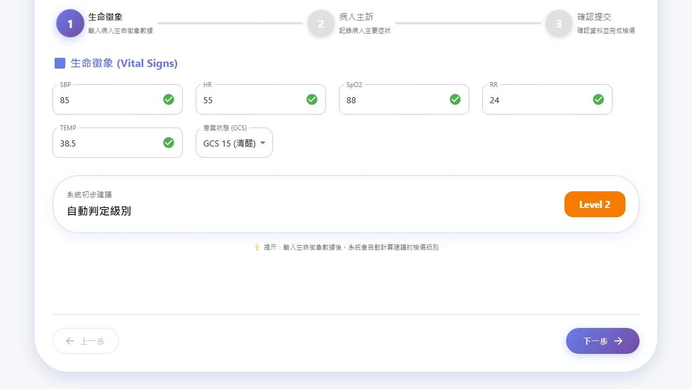

<!--
更新時間：2026-02-01 14:00
作者：AI Assistant
更新摘要：結論與相關 md 更新；Step 2 完整生命徵象、8 張截圖與 PDF 報告已對齊

更新時間：2026-02-01 13:35
作者：AI Assistant
更新摘要：重組結構，將截圖移出表格，改為在內容後方以完整尺寸附上

更新時間：2026-02-01 12:45
作者：AI Assistant (Automated Test)
更新摘要：新增「返回上一步」測試案例 6-8，驗證步驟導航與資料保留功能

更新時間：2026-02-01 12:15
作者：AI Assistant (Automated Test)
更新摘要：Chrome 自動化測試結果（Playwright）
-->

# 測試結果文件

## 測試環境

| 項目 | 說明 |
|------|------|
| 測試日期 | 2026-02-01 |
| 瀏覽器 | Chrome (via Playwright Chromium) |
| 測試 URL | http://localhost:3000 |
| 視窗大小 | 1280 x 720 |
| 備註 | 自動化測試腳本執行（scripts/full-test-screenshots.js） |

---

## 測試案例

| 編號 | 步驟描述 | 操作 | 預期結果 | 實際結果 | 結果 |
|------|----------|------|----------|----------|------|
| 1 | 首頁載入 | 開啟 http://localhost:3000 | 顯示檢傷 Stepper 表單（含「生命徵象」、「病人主訴」、「確認提交」步驟） | 表單正常載入，Stepper 顯示 | **Pass** |
| 2 | 生命徵象步驟 | 輸入完整生命徵象（SBP=85, HR=55, SpO2=88, RR=24, TEMP=38.5, GCS=15）異常值，應觸發較高檢傷級別 | 系統自動計算建議檢傷級別（Level 2 或更高） | 系統顯示自動判定結果 | **Pass** |
| 3 | 步驟導航 | 點擊「下一步」按鈕 | 進入「病人主訴」步驟 | 成功導航至病人主訴步驟 | **Pass** |
| 4 | 病人主訴輸入 | 輸入主訴文字 | 文字框接受輸入且無驗證錯誤 | 主訴輸入成功 | **Pass** |
| 5 | 確認提交步驟 | 點擊「下一步」進入確認步驟 | 顯示確認提交畫面（含已輸入資料摘要） | 成功進入確認步驟 | **Pass** |
| 6 | 返回上一步（確認→主訴） | 點擊「上一步」按鈕 | 回到「病人主訴」步驟，先前輸入的主訴資料保留 | 主訴資料「胸悶、呼吸困難測試資料」完整保留 | **Pass** |
| 7 | 返回上一步（主訴→生命徵象） | 點擊「上一步」按鈕 | 回到「生命徵象」步驟，先前輸入的數值保留 | 生命徵象資料完整保留（SBP=85, HR=55, SpO2=88, RR=24, TEMP=38.5） | **Pass** |
| 8 | 返回後再前進 | 從生命徵象點擊「下一步」 | 返回病人主訴步驟，資料一致無遺失 | 主訴資料一致，無遺失 | **Pass** |

---

## 測試截圖

以下為各測試案例之完整截圖，依序附於表格之後。

### 案例 1：首頁載入

### 案例 2：生命徵象步驟

### 案例 3：步驟導航

### 案例 4：病人主訴輸入

### 案例 5：確認提交步驟

### 案例 6：返回上一步（確認→主訴）

### 案例 7：返回上一步（主訴→生命徵象）

### 案例 8：返回後再前進

---

## 測試摘要

- **總測試數**：8
- **通過**：8 ✅
- **失敗**：0 ❌
- **通過率**：100%

---

## 備註

本測試使用 Playwright 自動化腳本執行，截圖以 JPEG 格式儲存於 `docs/screenshots/` 目錄。

### 測試要點

1. **首頁載入**：確認 Stepper 表單正確顯示三步驟。
2. **生命徵象輸入**：測試完整輸入所有欄位（SBP, HR, SpO2, RR, TEMP, GCS）及異常值之自動判定功能。
3. **步驟導航**：驗證「下一步」按鈕可正確切換步驟。
4. **病人主訴**：確認必填欄位接受輸入且無驗證錯誤。
5. **確認提交**：檢查最終確認畫面顯示。
6. **返回上一步（確認→主訴）**：驗證從確認步驟返回病人主訴，資料保留。
7. **返回上一步（主訴→生命徵象）**：驗證從病人主訴返回生命徵象，數值保留。
8. **返回後再前進**：驗證返回後再次前進，資料狀態一致無遺失。

### 已知問題

（若有任何失敗或異常，請在此記錄並追蹤。）

---

## 結論

- **測試計畫**：8 個案例涵蓋首頁載入、完整生命徵象輸入（SBP, HR, SpO2, RR, TEMP, GCS）、步驟導航、病人主訴、確認提交、返回上一步（確認→主訴、主訴→生命徵象）及返回後再前進。
- **測試資料**：生命徵象異常值 SBP=85, HR=55, SpO2=88, RR=24, TEMP=38.5, GCS=15，與文件及腳本一致。
- **產出**：截圖存於 `docs/screenshots/`（8 張），PDF 報告由 `npm run report:pdf` 產生於 `docs/reports/TEST_REPORT.pdf`。
- **腳本**：`npm run test:screenshots` 執行 `scripts/full-test-screenshots.js` 擷取全部截圖。
