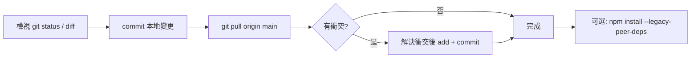

# Git 本地變更與 pull 衝突處理計劃

**更新時間：** 2026-02-02 15:35  
**作者：** AI Assistant  
**摘要：** Git pull 衝突處理方案與步驟指南

## 目前狀況

- **分支**：`main`（本地）
- **遠端**：`origin/main` 已更新為 `3295b92`（從 `d6608b7`）；另有多出遠端分支 `origin/fix/mobile-header-overflow`
- **錯誤原因**：本地有未提交變更，`git pull` 合併時會覆寫這些檔案，因此被中止

受影響的檔案（本地有修改、且遠端也可能有修改）：

| 檔案                                                             | 本地變更內容（先前工作）                                              |
| -------------------------------------------------------------- | --------------------------------------------------------- |
| [package.json](../package.json)                                   | ESLint 9、@types 更新、新 devDependencies、lint 腳本改為 `eslint .` |
| [package-lock.json](../package-lock.json)                         | 對應上述依賴的 lock 變更                                           |
| [src/components/MainLayout.tsx](../src/components/MainLayout.tsx) | ESLint 格式修正（縮排、單引號）                                       |

遠端 `main` 很可能也改動了上述檔案（例如來自 `fix/mobile-header-overflow` 的合併），因此需要先處理本地變更再拉取並解決可能的衝突。

---

## 建議下一步（三選一）

### 方案 A：先提交再 pull（建議，保留所有本地工作）

1. 檢視變更：`git status`、`git diff`（必要時包含 `package-lock.json`）
2. 將目前修改納入一次提交：
   - `git add package.json package-lock.json src/components/MainLayout.tsx`
   - `git commit -m "chore: ESLint 9 升級與 MainLayout 格式修正"`
3. 拉取並合併：`git pull origin main`
4. 若出現衝突：
   - 依 `git status` 打開標記為 "both modified" 的檔案
   - 手動解決衝突、保留或合併兩邊需要的內容後 `git add` 該檔案
   - 完成所有衝突檔案後執行 `git commit`（或依提示完成 merge/rebase）
5. 最後可選擇：`npm install --legacy-peer-deps` 確保依賴與 lock 一致

**適用**：要保留目前所有依賴升級與 MainLayout 修正，並與遠端 main 整合。

---

### 方案 B：暫存本地變更再 pull

1. 暫存：`git stash push -m "eslint9-and-mainlayout" -- package.json package-lock.json src/components/MainLayout.tsx`
2. 拉取：`git pull origin main`
3. 取回暫存：`git stash pop`
4. 若有衝突，在出現衝突的檔案中手動解決，然後 `git add` 並視情況完成 merge/rebase 或另做一次 commit

**適用**：想先讓本地 main 與遠端完全一致，再決定如何套回自己的修改。

---

### 方案 C：放棄本地變更（會丟失目前未提交工作）

1. 確認要丟棄：
   `git checkout -- package.json package-lock.json src/components/MainLayout.tsx`  
   或對整個工作目錄：`git reset --hard HEAD`
2. 再執行：`git pull origin main`

**適用**：確定不需要保留任何本地修改（不建議，除非你已備份或確認可丟棄）。

---

## 衝突時特別注意

- **package.json**：若遠端也改了依賴或腳本，需手動合併兩邊的 `dependencies` / `devDependencies` / `scripts`，避免重複或遺漏。
- **MainLayout.tsx**：若遠端有 UI 或邏輯改動，合併時保留功能邏輯並維持 ESLint 規則（縮排 2/4 空格、單引號）。
- 解決衝突後建議：`npm run lint`、`npm run dev` 快速確認專案可編譯、無明顯錯誤。

---

## 流程摘要（建議採用方案 A）

執行順序：**檢視變更 → 提交 → pull → 若有衝突則解決 → 必要時重新安裝依賴**。
